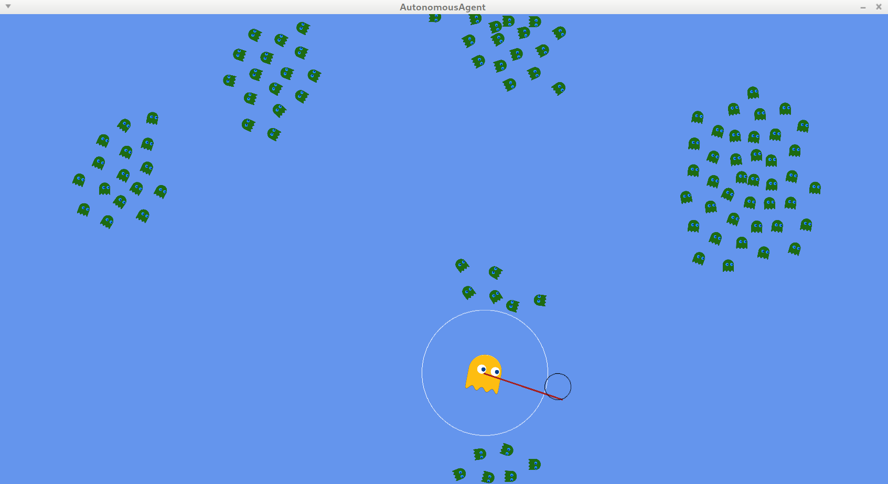
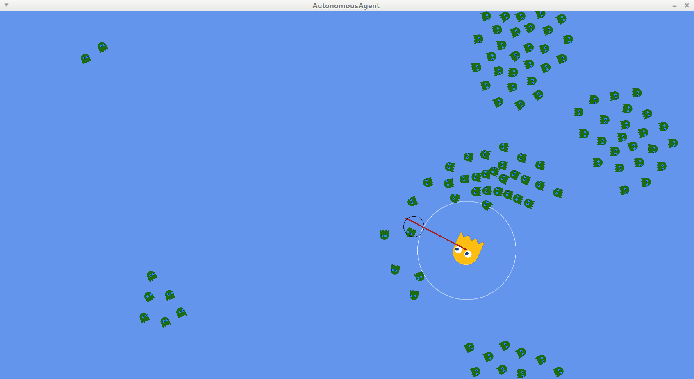

## Try it out

  - Sources can be compiled (I used MonoDevelop)
  - `RunningExample.zip` can be extracted and run with `mono AutonomousAgent.exe`

## Description
Implementation of some steering behavior using GNU/Linux, Monogame, and C# based on
paper from [Craig W. Reynolds](https://www.red3d.com/cwr/steer/gdc99/).

Each ghost has a defined detection zone whose boundaries are described by the circle drawn around them.
In other words they are only aware of events that occur in that area.

Ghosts are defined with a speed (linear and angular), some mass that allows to simulate entity inertia
and a maximal speed or force that can be applied to them.

Each behavior can be added together to form more complex behavior. This is illustrated with the
`Flocking` behavior.

## Scenes
You can navigate between scenes using `N` (next) and `P` (previous) keys. Scenes are
organized using a [FSM](https://en.wikipedia.org/wiki/Finite-state_machine).

***
**Seek**:
The Ghost follows the mouse cursor position.

***
**Arrive**:
The Ghost follows the mouse cursor (like in **Seek** behavior) but slow down before
arrival to avoid overstepping or going back and forth infinitely.

***
**Flee**:
The Ghost flees the mouse cursor.

***
**Wander**:
The ghost wanders aimlessly. In this behavior another debug circle is added.
It is used to determine the direction to be followed by the entity while avoiding
sudden changes.

***
**Evade / Pursuit**:
One ghost try to avoid another one. The one who runs away try to go in the opposite
direction of the opponent. The chaser try to anticipate the next position of the runner
to intercept him.
**Evade** and **Pursuit** represent more advanced version of **Flee** and **Seek**.

***
**Flocking**:
This is the most complex scene. Each small ghost just wander aimlessly but still
trying to avoid the bigger one. If you press `G`, they will pack together like
fish swarm and start to act as a whole. This behavior is called flocking and is
the result of the combination of **Separation** / **Cohesion** and **Alignment** behaviors.
That is, they are at the same time rejected / attracted and try to all go in
a common direction.

In a nutshell:

  - press `F` to make each small ghost acts only for itself (**Wander** / **Evade** / **Flee**)
  - press `G` to make them act as groups (**Wander** / **Evade** / **Flee** / **Alignment** / **Cohesion** / **Separation**)

